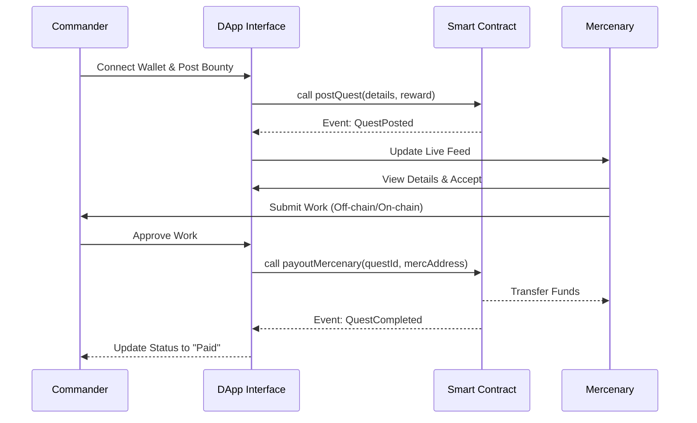

# ⚔️ MONAD MERCENARY

> **The Decentralized "In-Venue" Bounty Marketplace.**
> *Built for the speed of Monad. Styled for the Cyberpunk future.*


---

## 📋 Table of Contents
- [The Mission](#-the-mission)
- [Features](#-features)
- [Architecture](#-architecture)
- [Tech Stack](#-tech-stack)
- [Project Structure](#-project-structure)
- [How to Run](#-how-to-run)
- [Smart Contract](#-smart-contract)
- [Roadmap](#-roadmap)

---

## 💀 The Mission
In the chaos of a hackathon (or the sprawl of the metaverse), you need work done **NOW**.
**Monad Mercenary** is a hyper-local, peer-to-peer task board where:
1.  **Commanders** post bounties in $MON.
2.  **Mercenaries** execute the mission.
3.  **Settlement** happens on-chain, instantly.

---

## ⚡ Features
*   **Zero-Friction Onboarding**: Connect via Metamask/Rabby instantly.
*   **Cyberpunk UI**: Glassmorphism, neon-reactive components, and glitch aesthetics.
*   **Real-Time Feed**: Auto-refreshing "Live Operations" dashboard.
*   **Trustless Payouts**: Direct P2P value transfer via Smart Contract.
*   **Mock Mode**: Fully functional simulation mode for demos without gas costs.

---

## 🏛 Architecture

### Bounty Lifecycle


---

## 🛠️ Tech Stack
*   **Frontend**: Vanilla JS + Ethers.js v5.7 (No build steps required).
*   **Styling**: Tailwind CSS (CDN) + Custom `index.html`.
*   **Backend**: Solidity Smart Contract (`MonadMercenary.sol`).
*   **Network**: Optimized for Monad Testnet / Ethereum Sepolia.

---

## 📂 Project Structure

```bash
Monad Mercenary/
├── 📂 assets/          # Images and icons
├── 📂 contracts/       # Solidity smart contracts
│   └── MonadMercenary.sol
├── 📂 css/             # Custom styles
├── 📂 docs/            # Documentation
├── 📂 js/              # Application logic
│   ├── app.js          # Core DApp logic
│   └── utils.js        # Helpers
├── 📂 scripts/         # Deployment scripts
├── 📄 index.html       # Main entry point (Single Page App)
└── 📄 README.md        # This file
```

---

## 🚀 How to Run

### Option A: The Live Feed (Pre-Configured)
1.  The app is currently hardcoded to the **Live Deployed Contract**:
    > `0xd9145CCE52D386f254917e481eB44e9943F39138`
2.  Simply open `index.html` in any modern browser.
3.  Connect Wallet -> Post Bounty -> Pay Mercenary.
4.  **Note**: Ensure your wallet is connected to the correct network where the contract is deployed.

### Option B: Local / Mock Mode
1.  To run without a blockchain connection (UI Demo Mode), revert `CONTRACT_ADDRESS` in `index.html` to a dummy string or empty value.
2.  The app will automatically switch to simulation mode.

---

## 📜 Smart Contract
The contract `MonadMercenary.sol` handles:
*   `postQuest()`: Escrows the bounty amount.
*   `payoutMercenary()`: Releases funds to the specific worker address.
*   `getActiveQuests()`: Returns the live feed state.

---

## 🔮 Roadmap
*   [ ] **Reputation System**: XP for Mercenaries based on completed tasks.
*   [ ] **Encrypted Chat**: Secure communication channel for mission details.
*   [ ] **Multi-token support**: Allow payments in USDC/USDT.
*   [ ] **Arbiter DAO**: Dispute resolution mechanism.

---

*Built with code and caffeine for the Monad Hackathon.*

